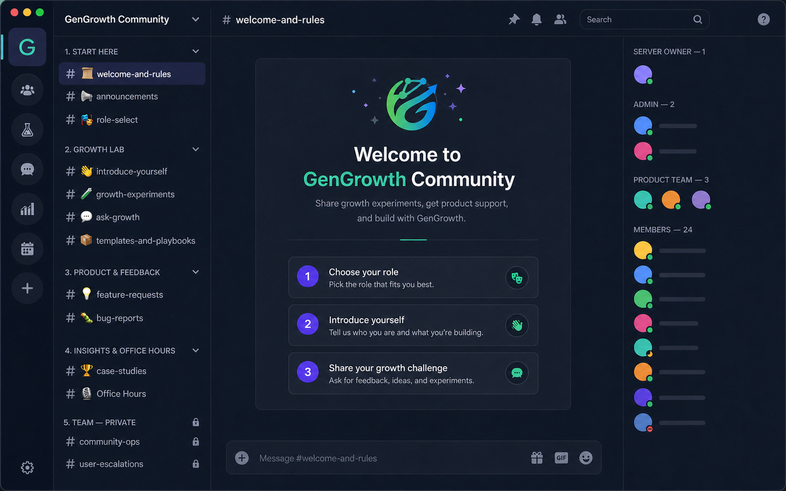

# GenGrowth Discord 社区搭建与启动 SOP



> 上图是按照本文频道结构生成的概念示意图，用来帮助理解搭建完成后的大概样子；不是 Discord 真实服务器截图，实际界面会随客户端版本和你的设置略有不同。

> 本 SOP 用于指导 GenGrowth 从零创建 Discord 社区、完成基础配置、进行内部测试，并分阶段邀请首批用户。执行节奏以稳妥起步为主，不要求第一周立即开放。

## 一、先搞清楚：你创建社区后叫什么

在 Discord 里，“社区”通常叫 **Server（服务器）**。

你亲自创建 Server 后，你的身份是：

- **Server Owner（服务器所有者）**：最高权限，整个服务器归这个账号；
- 你也拥有管理员能力，但准确名称不是“群主”，而是 Server Owner；
- **Administrator（管理员）**：一种可以分配给其他人的高权限；
- **Moderator（版主）**：管理消息、成员和违规，但通常不能改核心设置；
- **Community Manager（社区运营）**：负责欢迎、内容、活动和用户反馈，不一定需要最高权限。

如果是你负责创建和早期运营，初期可以是：

```text
你 = Server Owner + Community Manager
另一名稳定的公司负责人 = 备用 Admin
其他团队成员 = Product Team
```

服务器最好由公司长期可控的 Discord 账号创建，不要用临时账号。创建账号时使用公司可控制的邮箱，开启 2FA，并保存恢复码。

## 二、现在需要准备什么

搭建之前，先准备以下内容：

- [ ] 一台 Mac；
- [ ] 一部手机；
- [ ] 公司可控制的邮箱；
- [ ] GenGrowth Logo；
- [ ] 社区名称：`GenGrowth Community`；
- [ ] 一句话介绍；
- [ ] 另一名备用管理员；
- [ ] 第一批准备邀请的 5–10 个人；
- [ ] GenGrowth 产品入口和帮助链接；
- [ ] 一段欢迎语和简单规则。

一句话介绍建议：

> A community for SaaS founders, SEO/GEO practitioners, and growth teams to share experiments, get product support, and build better growth systems with GenGrowth.

## 三、下载 Discord

### Mac 端

1. 打开浏览器；
2. 进入 Discord 官方网站：`https://discord.com/download`；
3. 选择 macOS 版本；
4. 下载后打开安装文件；
5. 将 Discord 放进 Applications；
6. 打开 Discord，注册或登录公司长期可控的账号；
7. 在账号设置中开启双重验证（2FA）。

Mac 端用于主要搭建工作，因为创建频道、调整角色和检查权限更方便。

### 手机端

1. iPhone 打开 App Store，Android 打开 Google Play；
2. 搜索 `Discord`；
3. 确认开发者和应用名称无误后安装；
4. 登录与 Mac 端相同的账号；
5. 开启通知，但建议只保留提及、私信和重要频道通知。

手机端主要用于：及时回复成员、处理提醒、查看 Bug、主持语音活动和紧急管理。复杂权限设置尽量在 Mac 完成。

## 四、在 Mac 上创建 GenGrowth 社区

### 第 1 步：创建服务器

1. 打开 Discord；
2. 在左侧服务器列表找到 `+`；
3. 点击 **Create My Own**；
4. 选择面向 Community / Club 的选项；
5. 名称填写 `GenGrowth Community`；
6. 上传 GenGrowth Logo；
7. 点击创建。

创建完成后，你就是 **Server Owner**。

### 第 2 步：完成基础设置

点击左上角服务器名称 → **Server Settings**：

- 名称：GenGrowth Community；
- 图标：GenGrowth Logo；
- 简介：填写社区一句话定位；
- 默认通知：建议选择 Only @mentions；
- 开启管理员 2FA 要求；
- 开启 Community 功能；
- 开启基础 AutoMod 和垃圾信息拦截。

界面名称可能随着 Discord 更新略有变化，重点找这些模块：

```text
Overview
Roles
Safety / AutoMod
Community
Onboarding
Invites
```

### 第 3 步：创建角色

进入 **Server Settings → Roles**，先建立：

```text
Admin
Community Manager
Moderator
Product Team
Member
```

初期分配：

- 你：Server Owner，不需要再给自己额外最高角色；
- 一名公司负责人：Admin；
- 你或日常运营者：Community Manager；
- 产品同事：Product Team；
- 普通用户：Member。

注意：

- Admin 先控制在 1–2 人；
- 不要给普通成员 Administrator；
- 不要随便给 Bot Administrator；
- Product Team 可以回答问题，但不必拥有改服务器的权限。

## 五、大概搭建完成后的样子

参考你之前的分析，建议初期就建以下结构：

```text
📁 1. START HERE
├── 📜 #welcome-and-rules
├── 📢 #announcements
└── 🎭 #role-select

📁 2. GROWTH LAB
├── 👋 #introduce-yourself
├── 🧪 #growth-experiments
├── 💬 #ask-growth
└── 📦 #templates-and-playbooks

📁 3. PRODUCT & FEEDBACK
├── 💡 #feature-requests
└── 🐛 #bug-reports

📁 4. INSIGHTS & OFFICE HOURS
├── 🏆 #case-studies
└── 🎙️ Office Hours（语音频道）

📁 5. TEAM — PRIVATE
├── #community-ops
└── #user-escalations
```

这套结构和你图里的方向基本一致，但增加了团队私密区，方便内部处理用户问题。

### 每个频道做什么

| 频道 | 用途 |
|---|---|
| #welcome-and-rules | 欢迎语、GenGrowth 理念、社区规则、快速指引 |
| #announcements | 产品更新、新功能、活动预告 |
| #role-select | 选择 SaaS Founder、AI Builder、Growth Ops、SEO/GEO 等身份 |
| #introduce-yourself | 介绍自己、产品和当前最大增长问题 |
| #growth-experiments | 分享假设、动作、结果和复盘 |
| #ask-growth | 提问 UTM、渠道、SEO/GEO、增长策略等问题 |
| #templates-and-playbooks | 分享官方模板和社区共创资料 |
| #feature-requests | 提交产品建议和需求 |
| #bug-reports | 报告使用问题和 Bug |
| #case-studies | 展示用户案例和真实结果 |
| Office Hours | 之后用于语音 AMA、案例拆解；初期可先建但不急着每周开 |
| #community-ops | 仅团队可见，安排内容和活动 |
| #user-escalations | 仅团队可见，处理需要产品/技术跟进的问题 |

## 六、频道怎么创建

### 创建分类

1. 点击服务器名称；
2. 选择 **Create Category**；
3. 输入分类名称，例如 `1. START HERE`；
4. 按上面的结构依次创建五个分类。

### 创建文字频道

1. 点击分类旁边的 `+`；
2. 选择 Text Channel；
3. 输入频道名，例如 `welcome-and-rules`；
4. 创建后，在 Edit Channel 中添加 Topic，说明频道用途。

### 创建语音频道

1. 在 `4. INSIGHTS & OFFICE HOURS` 旁点击 `+`；
2. 选择 Voice Channel；
3. 名称填写 `Office Hours`；
4. 初期不需要复杂设置。

## 七、权限怎么设置

不用一开始做特别复杂的权限矩阵，只处理三类：

### 公开只读频道

`#welcome-and-rules`、`#announcements`：

- 所有人可以看；
- 只有 Owner、Admin 或 Community Manager 可以发消息；
- 普通成员不能发消息。

### 公开讨论频道

Growth Lab、Product & Feedback、#case-studies：

- Member 可以看和发消息；
- Moderator 可以删除违规消息或暂时禁言；
- Product Team 可以回答和跟进。

### 团队私密频道

TEAM — PRIVATE：

- 关闭 `@everyone` 的 View Channel；
- 只允许 Owner、Admin、Community Manager、Product Team 查看；
- 建好后必须用普通测试账号确认真的看不到。

权限尽量在“分类”上设置，让下面的频道继承，不要每个频道单独设置。

## 八、第一批要放进去的内容

不要创建完空着。邀请用户前，先发布：

1. Welcome + Rules；
2. 一条 GenGrowth 是什么；
3. 一条自我介绍示例；
4. 一条 Growth Experiment 示例；
5. 一条“你目前最大的增长问题是什么？”；
6. 一个 Template / Playbook；
7. 一条 Feature Request 格式；
8. 一条 Bug Report 格式。

欢迎语简版：

```text
Welcome to GenGrowth Community 👋

这里是 SaaS Founder、AI Builder、SEO/GEO 从业者和 Growth Ops 分享增长实验、获取 GenGrowth 产品支持、参与产品共创的社区。

加入后建议先做三件事：
1. 在 #role-select 选择身份
2. 在 #introduce-yourself 介绍你的产品和最大增长问题
3. 在 #ask-growth 或 #growth-experiments 开始第一次交流

请不要发布垃圾广告、私信骚扰或账号敏感信息。
```

Bug 格式：

```text
使用的功能：
遇到的问题：
复现步骤：
预期结果：
实际结果：
截图（请隐藏敏感信息）：
```

增长实验格式：

```text
产品/网站：
实验假设：
采取的动作：
观察指标：
当前结果：
下一步：
```

## 九、放缓版时间安排

Discord 刚起步，不需要第一周就正式开放，也不用马上每周做 Office Hours。

### 第 1 周：账号和骨架

只完成：

- 下载 Mac 和手机端 Discord；
- 注册公司长期可控的账号；
- 开启 2FA；
- 创建 GenGrowth Community；
- 建立分类、频道和基础角色；
- 配置公开、只读和私密权限。

本周目标：**服务器骨架搭好，但不对外邀请。**

### 第 2 周：内容和测试

完成：

- 写 Welcome、Rules 和频道说明；
- 放入 5–8 条冷启动内容；
- 配置简单身份选择；
- 找 1 名备用 Admin；
- 用普通测试账号检查权限；
- 同时在 Mac 和手机上测试。

本周目标：**新用户进来后不会面对空服务器，也不会看到内部频道。**

### 第 3 周：小范围试用

完成：

- 邀请 5–10 名熟悉的用户、朋友或合作伙伴；
- 每个新成员都人工欢迎；
- 观察他们是否知道该去哪个频道；
- 收集“看不懂、不会用、频道太多”的反馈；
- 删除或合并没有必要的频道。

本周目标：**验证结构是否好用，不追求活跃人数。**

### 第 4 周：第一批真实用户

完成：

- 一对一邀请 10–20 名已使用或对 GenGrowth 感兴趣的用户；
- 发起一个简单讨论，例如“你现在最大的自然增长问题是什么？”；
- 回复产品问题和反馈；
- 选一个真实案例整理到 #case-studies；
- 根据活跃情况决定什么时候开第一次 Office Hours。

本周目标：**让第一批真实用户获得一次具体价值。**

### 第 2 个月以后

当社区开始自然出现问题和讨论后，再考虑：

- 每两周或每月一次 Office Hours；
- Beta Tester 身份；
- 更多模板和 Playbook；
- 产品内 Discord 邀请入口；
- 邮件邀请；
- Ticket Bot 或更复杂自动化。

如果社区还很安静，不要继续增加频道和 Bot，先通过一对一邀请、问题回复和内容互动把现有频道跑起来。

## 十、你现在按这个顺序做

```text
1. Mac 下载 Discord
2. 手机下载 Discord
3. 用公司可控制邮箱注册
4. 开启 2FA，保存恢复码
5. Mac 上点击 + 创建 GenGrowth Community
6. 你自动成为 Server Owner
7. 创建 Admin / Community Manager / Product Team / Member 角色
8. 按本文创建 5 个分类和频道
9. 设置欢迎与公告只读、Growth Lab 可讨论、TEAM 完全私密
10. 发布 5–8 条初始内容
11. 用普通账号和手机测试
12. 第 3 周先邀请 5–10 人
```

完成第 11 步前，不建议把邀请链接放到官网或公开社媒。

## 十一、你暂时不需要做的东西

- 不需要一开始就找很多 Bot；
- 不需要复杂积分、等级和排行榜；
- 不需要每天发内容；
- 不需要马上每周开语音活动；
- 不需要把所有用户一次性拉进来；
- 不需要建二三十个频道；
- 不需要给很多人管理员权限。

现阶段最重要的是：**你能安全地拥有并管理服务器，新用户进来知道去哪里、能得到回应，而且团队内部问题不会暴露。**

## 十二、SOP 完成标准

满足以下条件，即可认为服务器完成初步搭建：

- [ ] 公司可控制的账号持有 Server Owner；
- [ ] Owner 和备用 Admin 已开启 2FA；
- [ ] 频道、角色及权限配置完成；
- [ ] TEAM — PRIVATE 对普通用户不可见；
- [ ] Welcome、Rules 和频道说明已经发布；
- [ ] 至少有 5 条冷启动内容；
- [ ] Mac、手机和普通测试账号均已测试；
- [ ] 已确定首批 5–10 名试用成员；
- [ ] 产品问题和 Bug 有明确跟进人；
- [ ] 尚未在官网或公开社媒大规模发布邀请链接。

达到以上标准后，进入第 3 周小范围试用阶段。

## 说明

本文根据现有 GenGrowth Ops 资料和用户提供的频道架构参考图整理。顶部图片是概念示意图，不是 Discord 真实截图。Discord 界面名称可能随客户端版本变化；下载时应使用 Discord 官方网站或官方应用商店页面。
