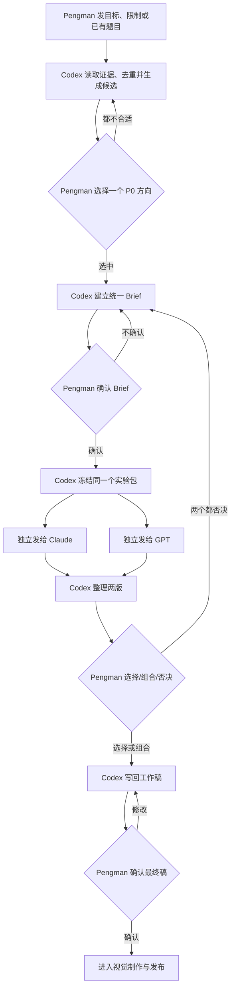

# Pengman 选题与双模型内容实验操作卡

> 这是一张给 Pengman 的简明操作卡，不是规则事实来源。选题执行以 [[inbox-pengman/04-production/00-evergreen-workflows/astrologywiki-social-daily/SKILL.md#Daily Workflow]] 为准；双模型详细规范以 [[inbox-pengman/04-production/00-evergreen-workflows/Pengman 与 AI 内容润色协作说明.md#双模型内容实验]] 为准。

## 先分清两个阶段

```text
阶段一：Codex 研究和粗选题 → Pengman 选中一个方向
阶段二：建立并确认 Brief → Claude / GPT 双模型独立写稿
```

不是让 Codex 随机生成一大堆题，再让 Pengman 从头研究。Codex 会先读取网站、SEO 主题参考、热点、竞品、旧稿和周报，完成去重与证据判断，并标出少量 P0 方向。Pengman 日常优先比较每条 Route 的 P0，不需要逐条研究所有备选。

双模型实验只比较“同一个已确认选题怎么写”，不负责从大量题目中替 Pengman 重新选题。

## 阶段一：先选题

### 1. Pengman 把最低限度要求发给 Codex

如果还没有具体选题，发：

```text
请开始今天的选题。
优先账号：【可留空】
优先平台/形式：【可留空】
今天的业务重点或限制：【无/具体要求】
```

如果已经有明确选题，发：

```text
请先检查并完善这个选题：【选题】。
账号：【账号】
平台：【平台】
形式：【短视频/图文/其他】
限制：【无/必须保留或避免的内容】
```

### 2. Codex 研究并给出候选

Codex 会读取网站、SEO 主题参考、热点、竞品、历史旧稿、最近发布记录及 `decision / next_test`，然后输出：

- Route A：生活问题或长期内容；
- Route B：当前热点；
- Route C：星盘配置或身份共鸣；
- 每条 Route 的 P0 推荐、证据、去重结果、账号、平台和形式建议。

### 3. Pengman 选一个方向

通常只需要回复：

```text
选择【Route / P0 选题】进入 Brief。
需要调整：【无/具体调整】
```

如果都不合适，直接否决并说明原因。此时不会启动 Claude / GPT，也不会浪费写稿次数。

## 阶段二：建立 Brief 并启动双模型实验

### 4. 确认或退回 Brief

Codex 会把选中的题整理成统一 Brief。Pengman 只需要检查：

- 发哪个账号和平台；
- 内容角度、受众和承诺是否正确；
- CTA 和落地页是否合理；
- 有什么不能写。

回复：

```text
Brief 确认，可以启动双模型实验。
```

如果方向不对，直接说明要改什么；此时不要急着让两个模型写稿。

> 双模型不是每条内容都必须使用。普通、低风险、已有稳定模板的内容可以直接由一个模型写；需要比较 Hook、角度或表达方案时再启动双模型实验。

### 5. 把同一个实验包分别发给 Claude 和 GPT

什么时候：Codex 已冻结模型实验包后。

怎么发：

1. 把 Codex 给出的 Claude 固定指令和完整实验包发到一个独立 Claude 对话；
2. 把 GPT 固定指令和完全相同的实验包发到一个独立 GPT 对话；
3. 不要把 Claude 的答案发给 GPT，也不要把 GPT 的答案发给 Claude；
4. 两边都生成完成后，把两份原始答案交回 Codex，或告诉 Codex 它们所在的位置。

如果 Codex 当前可以直接分发到两个独立模型，则由 Codex完成这一步，Pengman 不需要重复转发。

### 6. 选择并确认最终版本

什么时候：Codex 已把 Claude 和 GPT 两版并排整理后。

你可以选一个、组合、修改或两个都否决：

```text
实验【experiment_id】：
以【Claude/GPT】为主；
吸收另一版的：【无/具体 Hook、段落或 CTA】；
需要修改：【具体意见】；
是否确认最终稿：【是/生成组合版后再确认】。
```

- 如果回复“确认最终稿”，Codex 会写回生产记录并推进到制作阶段；
- 如果要求组合或修改，Codex 会生成新工作稿，继续等你确认；
- 如果两个版本都不对，回复“两个都否决，退回 Brief”，不要继续逐句润色。

## 一眼看懂



## 记住四条

1. 先选题，再确认 Brief，最后才启动双模型；不要让两个模型同时探索不同选题。
2. Claude 和 GPT 必须拿到完全相同的实验包，不能看到对方本轮答案。
3. 候选稿不是最终稿；只有 Pengman 明确确认后才进入正式制作。
4. 一次选择或修改只作为本条证据，不会自动修改长期 Skill。
