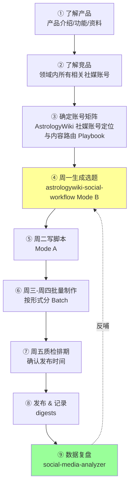
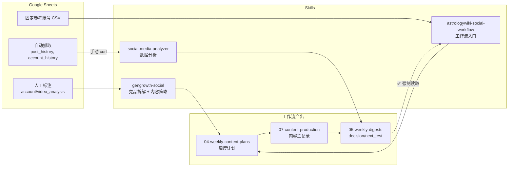
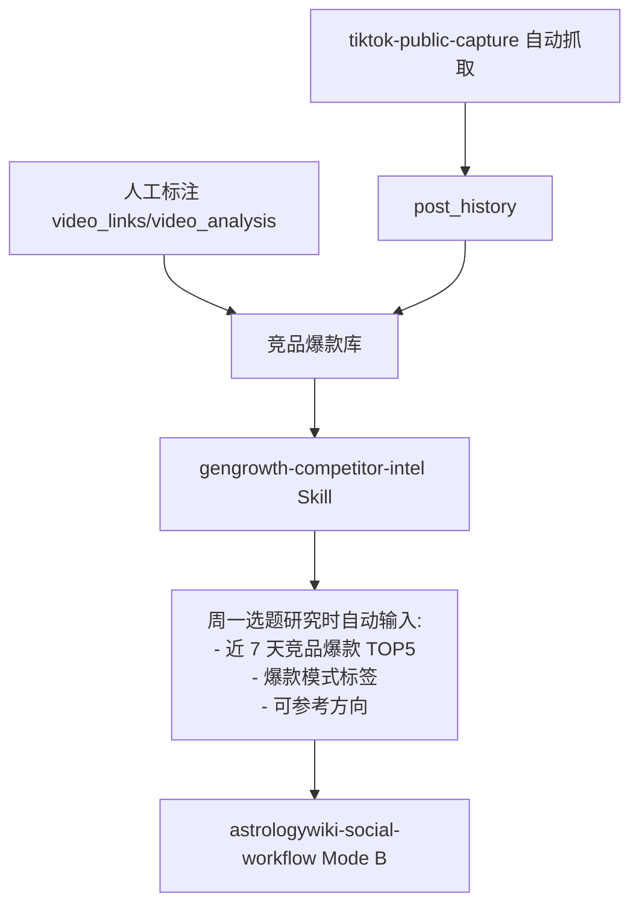

> **历史证据，不作为当前执行入口**；当前规则以 AGENTS、滚动周 SOP、当前周计划和单条主生产记录为准。

# 工作流与 Skill 诊断优化方案

## A. 当前状态诊断

### 完整工作流程图



**图例说明**：
- 绿色节点 = 已有反哺机制（数据复盘 → 选题）
- 黄色节点 = 需要手动操作的环节（竞品筛选、周一选题启动）

### 冗余清单（已清理）

| 冗余项 | 具体表现 | 处理方式 | 状态 |
|--------|---------|---------|------|
| `gengrowth-tiktok-strategist` | 与 gengrowth-social 功能重复，Hook/Format 建议重叠 | 合并到 gengrowth-social 的 `references/short-form-video.md` | ✅ 待执行 |
| `daily-content-assistant-sop` (211行) | 与 weekly-rolling-sop 重复，日执行逻辑已被周 SOP 覆盖 | 删除文件，周 SOP 已包含日执行卡 | ✅ 待删除 |
| `内容路由与规则调用说明.md` (50行) | 与 astrologywiki-social-workflow SKILL.md 完全重复 | 删除文件，Skill 为唯一来源 | ✅ 待删除 |

### 断点清单（修正后）

| 断点 | 实际状态 | 严重度 |
|------|---------|--------|
| **竞品爆款筛选**：需手动打开 Google Sheet 按 views 排序 | ✅ 有数据源（`post_history`），但需手动筛选 | P1（2 分钟操作） |
| **历史去重**：需手动在文件夹搜索关键词 | ✅ 文件结构清晰，但无索引 | P1（可接受） |
| **`post_history` → analyzer**：需手动 curl + 粘贴 | 数据获取有摩擦 | P2（可脚本化） |

**已纠正的误判**：
- ❌ "数据复盘 → 选题断裂" — **实际已有机制**（SOP § 4.周一明确要求读取 `decision/next_test`）
- ❌ "竞品研究 → 选题无对接" — **实际已有强制门槛**（Skill § 3 Mandatory Internet Research Gate）

### 数据流图



---

## B. 优化方案

### 1. Skill 架构（最终精简版）

```
保留（3 个核心）:
├── gengrowth-social                — 通用社媒策略
├── gengrowth-social-media-analyzer — 通用数据分析
└── astrologywiki-social-workflow   — AstrologyWiki 工作流入口
    （原名 astrologywiki-social-workflow，已改名）

删除（已确认重复）:
├── gengrowth-tiktok-strategist     — 合并入 gengrowth-social
├── daily-content-assistant-sop     — 合并入 weekly-rolling-sop
└── 内容路由与规则调用说明.md        — 功能已被 Skill 覆盖

暂不新增（手动流程可接受）:
├── gengrowth-competitor-intel      — 手动在 Google Sheet 筛选（2 分钟）
└── gengrowth-content-archive       — 手动搜索文件夹（秒级）
```

**Skill 改名说明**：
- **`astrologywiki-social-workflow` → `astrologywiki-social-workflow`**
- 原因：实际职责是"周度规划 + 日常执行 + 热点评估 + 补库"，不只是"每日选题"
- Mode A（日常执行）、Mode B（周一规划）、Mode C（补库）、Mode D（热点评估）
- 改名后更准确反映其作为"完整工作流入口"的定位

### 2. 历史文稿库方案

**存储**：保持现有 `07-content-production/` 目录结构不变。

**索引文件**：新增 `07-content-production/INDEX.md`，自动维护：

```markdown
| content_id | 日期 | 账号 | 主题标签 | 表现等级 | 文件链接 |
|---|---|---|---|---|---|
| scorpio-psychology-3 | 2026-07-20 | @astrologywiki | scorpio, psychology | B | [链接](./...) |
```

**查询接口**：通过 `gengrowth-content-archive` Skill 提供：
- 按星座/主题/账号/日期范围查询
- 去重检查：输入选题关键词 → 返回相似历史内容
- 表现参考：按账号+主题维度返回历史平均表现

**去重逻辑**：基于主题标签 + 标题相似度，在选题生成时自动检查，标记"30天内已有相似内容"。

### 3. 竞品分析反哺机制



**`gengrowth-competitor-intel` Skill 职责**：
1. 从 `post_history` 筛选竞品账号近期高表现帖子（views > 账号均值 3x）
2. 从 `video_analysis` 读取人工标注的竞品分析
3. 提炼爆款模式（hook 类型、话题角度、格式）
4. 输出"本周竞品洞察摘要"供选题使用

### 4. 通用化改造路径

**核心思路**：通用 Skill 不含任何产品名/账号名，通过运行时 context 注入差异。

```
对新产品（如健身 App）复用流程：

需要新建:
├── fitness-app-social-daily/SKILL.md  — 产品特定 Skill（仿 astrologywiki-social-workflow 结构）
├── 04-production/ 同结构目录
└── Google Sheet（新的自动抓取配置）

直接继承（零改动）:
├── gengrowth-social              ✅
├── gengrowth-social-media-analyzer ✅
├── gengrowth-competitor-intel    ✅
├── gengrowth-content-archive     ✅
├── weekly-rolling-content-production-sop ✅（通用版）
└── 统一内容 Brief 模板           ✅

需要填写的 Context:
├── product_context.md   — 产品定位、目标用户、品牌调性
├── account_context.md   — 各账号定位、内容支柱、路由规则
└── analysis_context.md  — benchmark 数据、KPI 目标、竞品列表
```

---

## C. 实施步骤（渐进式）

### 第 1 步：合并 Skill（本周，30 分钟）

| 行动 | 具体操作 |
|------|---------|
| 合并 `tiktok-strategist` | 1. 把 Hook 评估框架复制到 `gengrowth-social/references/short-form-video.md`<br>2. 在 `gengrowth-social/SKILL.md` 顶部加交叉引用<br>3. 删除 `skills/gengrowth-tiktok-strategist/` |
| 明确 Skill 边界 | 在 `gengrowth-social` 和 `social-media-analyzer` 各自 SKILL.md 顶部加一句边界说明 |

### 第 2 步：优化配置管理（下周，可选）

| 行动 | 具体操作 |
|------|---------|
| 抽离账号配置 | 创建 `04-production/00-config/accounts.yaml`（见 B.2 历史文稿库方案后的配置示例） |
| 修改 SOP | SOP § 2 配额表改为"读 accounts.yaml"，删除硬编码数字 |
| 修改 Skill | Skill § 6 账号路由改为"读 accounts.yaml" |

**好处**：未来新增/删除账号只需改 YAML，不改 SOP 或 Skill

### 第 3 步：简化状态跟踪（未来，可选）

| 行动 | 具体操作 |
|------|---------|
| 周计划只存指针 | 修改周计划模板：状态列改为"状态链接"，指向单条主记录 |
| 工具支持 | 写 `scripts/check-week-status.sh` 自动汇总本周所有 content_id 的真实状态 |

**好处**：避免周计划和主记录的状态不同步

---

## E. 完整工作流 AI 协作指南

> **每个环节：用什么工具 + 调用什么 Skill + 怎么和 AI 说**

### ① 了解产品（新产品启动）

**目标**：建立产品知识库（产品是什么、功能、特点、用户画像）

**输入材料**：
- 产品介绍文档
- 功能列表
- 目标用户描述
- 产品网站/App 截图
- 核心卖点
- 用户痛点

**Skill**：无需调用 Skill，直接和 AI 对话

**AI 协作方式**：
```
"我有一个新产品要做社媒运营，叫 [产品名]。

产品信息：
- 是什么：[产品介绍]
- 核心功能：[功能列表]
- 目标用户：[用户画像]
- 核心卖点：[独特价值]
- 解决什么痛点：[用户需求]
- 产品网站：[链接]

请帮我整理成结构化的产品知识库，
包含：产品定位、目标受众、核心价值、品牌调性、禁忌事项"
```

**产出**：
- `product-context.md`（产品知识库）
- 为下一步了解竞品提供方向

**示例（AstrologyWiki）**：
```
产品：AstrologyWiki
是什么：在线占星工具和知识库，提供星盘查询、星座解读、天象日历
目标用户：18-35 岁对占星感兴趣的年轻人，主要女性
核心卖点：专业但不说教，心理占星视角，工具实用
用户痛点：市面占星内容要么太玄要么太学术，缺少"懂我"的中间层
```

---

### ② 了解竞品（持续监测）

**目标**：掌握**领域内所有相关社媒账号**的内容策略和爆款模式

**范围**：
- **不局限于单一产品**：而是整个占星/星座内容领域
- **包括**：占星产品官方号、占星师个人号、占星内容矩阵号、小号、测试号
- **平台**：TikTok、Instagram、YouTube、小红书等

**数据源**：
- **自动抓取**：Google Sheet `post_history` 表（TikTok 账号数据）
- **人工标注**：Google Sheet `video_analysis` 表（深度拆解爆款）
- **固定参考账号索引**：CSV（`https://script.google.com/.../exec`）
- **手动发现**：在各平台搜索 astrology / zodiac / horoscope 相关账号

**Skill**：`gengrowth-social`（用于拆解竞品内容策略）

**AI 协作方式**：

**场景 A — 建立竞品账号库**（首次设置）：
```
"帮我建立占星领域的竞品账号库。

已知账号：
- @curatedastrology (TikTok, 500K followers)
- @astropoets (Instagram, 1M followers)
- @chani.nicholas (多平台)
- [补充更多]

请帮我：
1. 分类这些账号（产品官方号 / 占星师个人号 / 内容矩阵号）
2. 识别每个账号的内容定位和特点
3. 标注哪些账号适合作为参考（内容质量、互动率、风格）
4. 输出竞品账号索引表

我会把这个索引维护在 Google Sheet 和固定参考 CSV 中"
```

**场景 B — 查看领域爆款**（每周一选题前）：
```
手动操作（2 分钟）：
1. 打开 Google Sheet post_history
2. 按 views 降序排列
3. 查看竞品账号库中所有账号近 7 天数据
4. 筛选出爆款（views > 账号均值 3x）

然后告诉 AI：
"领域内近 7 天有 5 条爆款：
- @curatedastrology: Scorpio 嫉妒心理 [链接] (150K views)
- @astropoets: Moon Sign 约会 [链接] (200K views)
- @chani.nicholas: Leo New Moon [链接] (180K views)
...

调用 gengrowth-social 的 reverse-engineering 框架，
识别本周领域热点话题和爆款模式"
```

**场景 C — 深度拆解单条视频**：
```
"调用 gengrowth-social，
拆解这条领域爆款 [链接]：
- 前 3 秒 Hook 是什么
- 用了什么叙事结构
- 话题角度（心理/关系/事件/工具）
- 目标受众（泛兴趣/深度用户）
- CTA 设计
- 评论区用户在讨论什么
- 我们的产品 AstrologyWiki 可以如何切入这个话题"
```

**产出**：
- 竞品账号索引（持续更新）
- 领域爆款清单
- 可借鉴的 Hook 模式和话题方向

---

### ③ 确定账号矩阵（首次设置，账号调整时）

**目标**：基于产品定位和竞品分析，设计自己的账号矩阵策略

**输入**：
- ① 的产品知识库
- ② 的竞品账号分析
- 业务目标（品牌曝光/流量/转化）

**Skill**：`gengrowth-social`（用于账号策略设计）

**AI 协作方式**：
```
"基于产品 AstrologyWiki 和竞品分析，
帮我设计 TikTok 账号矩阵策略。

背景：
- 产品定位：[从 product-context.md 复制]
- 竞品观察：[总结领域内账号类型和空白机会]
- 业务目标：品牌曝光 + 工具引流

请设计：
- 需要几个账号（2-5 个）
- 每个账号的定位和差异化
- 内容支柱和禁止事项
- 每周产能分配
- 账号间如何互补

调用 gengrowth-social 的内容支柱框架和平台策略"
```

**产出**：
- `AstrologyWiki 社媒账号定位与内容路由 Playbook.md`（或 three-account / five-account）
- 每个账号的清晰定义
- 为选题生成提供路由规则

**示例（AstrologyWiki 现有 4 账号）**：
```
@astrologywiki 官方号：品牌、天象、工具承接
@ai.astrologer：占星 × 心理机制，固定人设
@hotastrotest：事件流量测试，24-48h 时效
@casualastro：低成本 Hook 探测，Sun Sign 关系梗
```

---

### ④ 周一生成选题（批量生产起点）

**目标**：锁定全周 8+2 条选题，按账号路由，确认 Batch

**Skill**：`astrologywiki-social-workflow` **Mode B**

**前置准备**（手动操作 5 分钟）：
1. 打开 Google Sheet `post_history`，查看竞品近 7 天爆款
2. 打开最近一期 `05-weekly-published-content-digests/`，看 `decision/next_test` 章节
3. 确认本周可用时间和产能

**AI 协作方式**：
```
"调用 astrologywiki-social-workflow Mode B，
生成本周选题池。

背景信息：
- 本周可用时间：20 小时
- 竞品爆款观察：[手动填写] @curatedastrology 的「Scorpio 嫉妒心理」视频爆了
- 上周复盘结论：[从 digest 复制] next_test 说要测试 Moon Sign 内容
- 本周天象：[查日历] 7 月 25 日 Leo New Moon

请输出：
- Evergreen 候选 5 条
- Predictable 候选 2 条（含 Leo New Moon）
- Hot 候选 1 条（Scorpio 嫉妒话题）

每条包含：
- 账号分配（当时按账号 Playbook 路由；当前文件为 `AstrologyWiki 社媒账号定位与内容路由 Playbook`）
- 形式（AI 口播 / slideshow / photo）
- effort（S/M/L）
- batch_id
- 过期日期（Predictable/Hot 必须）"
```

**产出**：
- 周计划文件：`04-production/03-weekly-content-plans/2026-W30 周度内容计划.md`
- 包含 Publishing This Week 和 Producing for Next Week 两个清单

---

### ④ 周二写脚本（批量写稿）

**目标**：完成 Brief + 脚本，确认 Hook 和 CTA

**Skill**：`astrologywiki-social-workflow` **Mode A**（推进既定内容）

**AI 协作方式**：

**场景 A — 批量写 Brief**：
```
"调用 astrologywiki-social-workflow Mode A，
今天要写本周锁定的 8 条内容的 Brief。

按账号分组：
- @astrologywiki 官方账号 2 条：Leo New Moon 解读 + 天象工具演示
- @ai.astrologer 2 条：Scorpio 嫉妒心理 + Virgo 完美主义
- @casualastro 3 条：Sun Sign 关系梗系列

每条 Brief 包含：
- Target Hook（前 3 秒说什么）
- 核心承诺
- 3-5 个要点
- CTA（哪个 AstrologyWiki 页面）
- 素材需求"
```

**场景 B — 写脚本并确认**：
```
"基于刚才的 Brief，
写 'Scorpio 嫉妒心理' 的完整脚本（60 秒 AI 口播）。

要求：
- 按 gengrowth-social 的 Hook 公式设计开场
- 用 @ai.astrologer 的固定人设（专业但不说教）
- 参考竞品 @curatedastrology 的叙事结构，但差异化角度
- 结尾 CTA 自然承接 astrologywiki.com/scorpio"

AI 输出脚本后，我确认：
✓ Hook 是否足够强
✓ 账号语气是否对
✓ 事实是否准确（Scorpio 行星配置）
✓ CTA 是否自然
```

**产出**：
- 单条主记录：`07-content-production/2026-07-22/scorpio-jealousy-001.md`
- 状态更新：`content_stage: scripted`

---

### ⑤ 周三-周四批量制作（按形式分 Batch）

**目标**：完成素材准备 + 剪辑，按视频形式批量生产

**Skill**：`astrologywiki-social-workflow` **Mode A**

**AI 协作方式**：

**周三 — 轻形式 Batch**（slideshow / photo / 字幕视频）：
```
"调用 astrologywiki-social-workflow Mode A，
今天推进 batch-w30-slideshow 的 3 条内容。

需要 AI 帮我：
1. 生成每条的图片素材需求清单（星盘图 / B-roll / 文字卡片）
2. 生成字幕文件（SRT 格式）
3. 检查是否有账号串号（3 条分别属于不同账号）

我负责：
- 实际制作星盘图（用工具）
- 剪辑合成
- 封面设计"
```

**周四 — 重形式 Batch**（AI 口播 / 明星星盘）：
```
"调用 astrologywiki-social-workflow Mode A，
今天推进 batch-w30-voiceover 的 2 条 AI 口播内容。

需要 AI 帮我：
1. 生成 AI 主播提示词（声音、语气、停顿）
2. 生成 B-roll 素材建议（配合脚本节奏）
3. 核验事实（明星出生时间、星盘配置）

我负责：
- 调用 AI 配音工具
- 剪辑 + 字幕
- 质检"
```

**产出**：
- 单条主记录状态更新：`content_stage: edited`
- 视频文件存储在对应目录

---

### ⑥ 周五质检排期（最后检查）

**目标**：审核成片，确认发布时间，检查库存

**Skill**：`astrologywiki-social-workflow` **Mode A**

**AI 协作方式**：
```
"调用 astrologywiki-social-workflow Mode A，
今天质检本周完成的 8 条内容。

帮我逐条检查：
✓ Hook 前 3 秒是否符合 TikTok 格式（参考 gengrowth-social）
✓ 账号语气是否串号
✓ 事实是否准确（天象日期、星座特质）
✓ CTA 是否自然
✓ 字幕关键词是否高亮
✓ 封面是否清晰

然后输出：
- 本周 Publishing This Week 的 8 条是否全部 ready
- 下周库存状态（每个账号的最低库存是否达标）
- 是否有内容需要返工"
```

**产出**：
- 单条主记录状态更新：`content_stage: scheduled`
- 周计划更新：确认发布日期

---

### ⑦ 发布 & 记录（执行发布）

**目标**：发布内容并记录链接

**工具**：TikTok App（手动发布）

**Skill**：无需调用 Skill

**AI 协作方式**：
```
发布后，告诉 AI：
"今天发布了 2 条内容：
- scorpio-jealousy-001：TikTok 链接 [链接]
- leo-new-moon-002：TikTok 链接 [链接]

请更新主生产记录：
- content_stage: published
- 添加 published_url
- 记录发布时间"
```

**产出**：
- 单条主记录更新：`published_url` + `published_at`

---

### ⑧ 数据复盘（周五晚或周日）

**目标**：分析表现，写 `decision/next_test`，反哺下周选题

**数据源**：Google Sheet `post_history` 表（24 小时后数据更新）

**Skill**：`social-media-analyzer`

**AI 协作方式**：

**步骤 1 — 获取数据**（手动操作 2 分钟）：
```
1. 打开 Google Sheet 自动抓取表
2. 运行 curl 命令获取 post_history 数据：
   curl -sL "https://script.google.com/.../exec?action=getData&sheet=post_history"
3. 复制本周发布的 8 条内容的数据（views, likes, comments, shares）
```

**步骤 2 — 调用分析 Skill**：
```
"调用 social-media-analyzer，
分析本周 8 条内容的表现。

数据（粘贴 JSON）：
[从 curl 结果粘贴]

请输出：
- 每条的 engagement rate
- 账号级别的平均表现
- TOP 3 和 BOTTOM 3
- 与历史 benchmark 对比
- 成功因素分析（Hook / 话题 / 形式）"
```

**步骤 3 — 写复盘结论**：
```
"基于分析结果，
帮我写本周的 decision/next_test 章节：

格式：
## Decision / Next Test

**本周发现**：
- [数据观察]

**下周测试方向**：
- [ ] 测试假设 1
- [ ] 测试假设 2

**不再做**：
- [明确放弃的方向]

保存到：05-weekly-published-content-digests/2026-07-21.md"
```

**产出**：
- Digest 文件：`05-weekly-published-content-digests/2026-07-21.md`
- 包含 `decision/next_test` 章节
- **下周一 Mode B 会强制读取这个结论**

---

## F. Skill 快速触发表

| 我想做什么 | 调用什么 Skill | Mode/参数 |
|-----------|--------------|----------|
| 拆解竞品视频的内容策略 | `gengrowth-social` | 使用 reverse-engineering 框架 |
| 周一生成全周选题池 | `astrologywiki-social-workflow` | Mode B |
| 问"今天该做什么" | `astrologywiki-social-workflow` | Mode A |
| 写 Brief / 写脚本 / 推进制作 | `astrologywiki-social-workflow` | Mode A |
| 评估突发热点是否值得做 | `astrologywiki-social-workflow` | Mode D（Hot 评估） |
| 分析发布数据 | `social-media-analyzer` | 输入 post_history 数据 |
| 查看 TikTok Hook 公式 | `gengrowth-social` | 读 references/short-form-video.md |

---

## G. 常见问题 AI 协作示例

### Q1: "竞品 @curatedastrology 有条视频爆了，我要不要做类似的？"

**完整流程**：
```
第 1 步：拆解竞品
"调用 gengrowth-social，
拆解竞品视频 [链接] 的 Hook、结构、话题角度"

第 2 步：Hot 评估
"调用 astrologywiki-social-workflow Mode D，
评估这个话题作为 Hot 的得分（10 分制）"

第 3 步：去重检查
"在 07-content-production/ 搜索关键词 'Scorpio jealousy'，
看我们 30 天内是否做过类似内容"

第 4 步：生成差异化选题
"如果 Hot 得分 ≥8 且未重复，
调用 astrologywiki-social-workflow Mode C，
基于竞品拆解 + 账号定位生成差异化选题"
```

### Q2: "上周发的内容表现怎么样？哪些值得继续做？"

**完整流程**：
```
第 1 步：获取数据
手动操作：curl Google Sheet post_history

第 2 步：分析
"调用 social-media-analyzer，
分析上周 8 条内容，输出 TOP 3 成功因素"

第 3 步：写复盘
"基于分析，写 decision/next_test，
明确下周测试方向和不再做的方向"
```

### Q3: "我想新增一个 Instagram 账号，流程怎么复用？"

**完整流程**：
```
第 1 步：定义账号
"帮我设计 Instagram @astrowiki.ig 的账号定位：
- 目标受众
- 内容支柱
- 与 TikTok 账号的差异
- 每周配额"

第 2 步：更新配置（未来优化，见 B.优化方案）
在 accounts.yaml 添加新账号配置

第 3 步：测试路由
"调用 astrologywiki-social-workflow Mode B，
测试新账号的选题路由是否正确"

通用 Skill 无需修改：
✓ gengrowth-social（通用策略）
✓ social-media-analyzer（通用分析）
```

---

### Q1: 查"上个月我们发过哪些关于 Scorpio 的内容"

**当前**：需要手动翻 `07-content-production/` 目录，逐个打开文件名含 Scorpio 的文件。

**优化后**：调用 `gengrowth-content-archive` → 输入 `topic:scorpio date:2026-06` → 返回索引表中所有匹配项，含账号、表现等级、文件链接。

### Q2: 竞品 @curatedastrology 有条视频爆了，分析并生成类似选题

**完整流程**：
1. `gengrowth-competitor-intel` → 从 `post_history` 或 `video_analysis` 拉取该视频数据
2. `gengrowth-social` → reverse-engineering 框架拆解（hook、结构、话题角度）
3. `gengrowth-content-archive` → 去重检查我们是否做过类似内容
4. `astrologywiki-social-workflow` Mode C → 基于拆解结论 + 账号定位生成差异化选题

### Q3: 为"健身 App"的 Instagram 账号复用流程

**需要新建**：产品 Skill `fitness-app-social-daily`、`product_context.md`、`account_context.md`、对应 Google Sheet

**直接继承**：所有 `gengrowth-*` 通用 Skill、Brief 模板、周 SOP（通用版）、analyzer

### Q4: "数据复盘 → 下周选题"循环的自动化程度

| 环节 | 当前状态 |
|------|---------|
| 发布后数据写入 digest | ✅ 半自动（人工触发 curl + 格式化） |
| 写 `decision/next_test` | ✅ 人工判断 |
| 下周选题时读取 decision | ❌ **完全断裂**（Skill 不强制读取） |
| 竞品数据影响选题 | ❌ **完全断裂**（无对接机制） |
| 历史表现影响选题权重 | ❌ **完全断裂**（无索引可查） |
