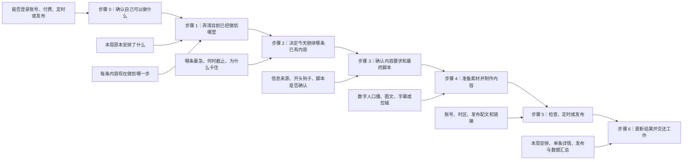

# 社媒内容生产接手指南

这份文档供**第一次接触 Pengman 工作区的人类和其 AI 助手**使用。适用场景包括临时请假、星期中途接手、协助生产，以及新成员第一次参与选题、制作或发布。

它是鱼骨式导航，不是第二套 SOP、日历或状态表：本页告诉你先后顺序、判断分支和完成标准；具体规则通过 Obsidian 链接进入现有权威文件。

## 先记住三句话

1. **星期中途接手时，不要从选题重新开始。**先执行当前周已经锁定的内容。
2. **先看本周原本安排了什么，再逐条确认每条内容实际上做到哪一步。**如果安排与实际进度不一致，以每条内容详情页里的实际进度为准。
3. **不确定账号、付费、发布权限或事实时先停。**不要猜密码、补事实、调用付费工具或把草稿发出去。

## 总鱼骨



纯文字主骨：

```text
确认自己可以做什么
→ 弄清目前已经做到哪里
→ 选择今天继续的已有内容
→ 确认内容要求和最终脚本
→ 准备素材并制作
→ 检查、定时或发布
→ 更新结果并交还工作
```

### 图里这些词具体指什么

| 普通说法 | 工作区里的名称 | 实际是什么 |
|---|---|---|
| 本周原本安排了什么 | 当前周计划 | 本周准备发布和制作哪些内容、先后顺序、截止时间以及谁负责 |
| 每条内容现在做到哪一步 | `content_stage` | 每条内容的实际进度：已选中、制作中、可以发布或已经发布。人类不需要记英文值，查看详情页的当前阶段即可 |
| 每条内容详情页 | 单条主记录 | 一条内容唯一的工作页面，保存选题、脚本、制作情况、发布时间、链接和结果 |
| 为什么卡住 | 阻塞 | 现在不能继续的具体原因，例如没有脚本确认、没有账号权限、缺素材或等待付费授权 |
| 信息从哪里来 | 证据 / 信息来源 | 支撑选题和文案的网页、竞品视频、平台数据、用户讨论或内部记录 |
| 内容要求说明 | Brief | 动手写稿和制作前的一页说明：写给谁、讲什么、发在哪个账号、用什么形式、注意什么 |
| 开头吸引观众的话 | Hook | 视频或帖子的第一句话、第一屏文字或第一个画面 |
| 已发布内容与数据汇总 | weekly digest / 发布汇总 | 本周实际发布了什么、真实链接和已取得的数据；它不代表单条内容的制作进度 |

后文为了让 AI 能准确找到文件，仍会保留 `content_stage`、Brief、主记录等名称；第一次接手的人按上表理解即可，不需要先学习项目管理术语。

## 第一次接手：前 20 分钟

### 0–5 分钟：先读懂这份指南

先阅读本页的“先记住三句话”“总鱼骨”和术语解释表，了解整个工作大致分成哪些步骤。

这 5 分钟不需要填写表格，不需要记录接手人或接手时间，也不要马上开始制作。

等实际进行到账号登录、付费生成、定时或正式发布时，再直接向 Pengman 或当时负责这项工作的人确认能不能操作即可。

### 5–12 分钟：让 AI 读取最小资料

按顺序读取：

1. 本接手指南：先理解整体步骤和常用词。
2. [[inbox-pengman/AGENTS|工作区规则]]：由 AI 读取，确认哪些事情可以做、哪些不能自行操作。
3. [[inbox-pengman/02-生产/README|内容生产工作区入口]]：了解当前文件分别放在哪里。
4. [[inbox-pengman/02-生产/04-weekly-content-plans/README|本周内容安排入口]]中的当前周计划：确认本周原本准备做什么。
5. [[inbox-pengman/02-生产/02-content-production/README|每条内容详情入口]]：根据当前周计划里的 `content_id`，打开对应内容，确认实际上做到哪一步。
6. [[inbox-pengman/02-生产/01-reference/AstrologyWiki 社媒账号分工与内容发布指南|账号分工与内容发布指南]]：确认每个账号负责什么、内容应该发到哪里。
7. [[inbox-pengman/02-生产/03-data-review/README|最近周报和数据复盘入口]]，以及 `02-生产/02-content-production/已发布/` 中的当前已发布内容：确认最近真正发布了什么、结果如何。

如需快速概览，可以最后再读 [[inbox-pengman/02-生产/00-evergreen-workflows/ai-advisor/当前状态与决策记录|当前状态与决策记录]]。它只是方便阅读的滚动摘要，不是必读事实来源；若与当前周计划或每条内容详情冲突，以更具体、更新的内容详情为准，并把冲突列出来。

### 12–20 分钟：让 AI 整理一页“现在该做什么”

AI 读完上面的资料后，先把复杂记录翻译成普通人能看懂的一页概况：

```markdown
## 我实际读了哪些资料
-

## 本周原本准备做什么
-

## 每条内容目前的情况
| 内容 | 准备发到哪里 | 目前做到哪一步 | 接下来具体做什么 | 为什么暂时不能继续 |
|---|---|---|---|---|

## 今天先做什么
1.
2.
3.

## 开始前需要问 Pengman 的事情
- 需要确认的脚本：
- 需要付费的操作：
- 需要登录、定时或发布的操作：
- 资料里没有写清楚的事情：
```

接手人只需要确认 AI 有没有读错，以及建议顺序是否符合当天实际情况。确认后从第一项开始，不需要再填写交接表。

## 星期中途接手：今天先做哪件事

星期二至星期五通常不需要重新选题，也不要重新安排整周。按下面的顺序检查当前周已有内容：

1. 原定今天或更早发布、但还没有完成的内容；
2. 已经设置定时发布的内容，确认它是否按时公开；
3. 截止时间最近，而且现在可以继续做的内容；
4. 已经做到一半，或已经花过生成费用的内容；
5. 上述工作完成后，再制作已经列入计划、可以作为下周库存的内容。

只有以下情况才重新选题：周一制定新一周安排、Pengman 明确要求调整、确认需要补充库存，或者出现必须及时跟进的热点。具体规则见 [[inbox-pengman/02-生产/00-evergreen-workflows/weekly-rolling-content-production-sop|每周内容生产流程]]。

## 怎样判断一条内容接下来要做什么

每条内容详情页都会记录实际进度。人类看中文含义即可；AI 负责识别和更新括号里的系统字段。

| 页面显示的实际进度 | 代表什么 | 接下来做什么 |
|---|---|---|
| 已选中（`selected`） | 已经决定要做，但还没有正式开始制作 | 查看内容要求、信息来源和脚本；缺什么就先补什么，脚本确认后开始制作 |
| 制作中（`producing`） | 已经开始生成、剪辑或组装 | 打开现有工程继续完成，不要从头重做 |
| 可以发布（`ready`） | 成片和基本检查已经完成 | 查看是否已经定时；没有定时就确认发布时间，已经定时就等待并核验公开结果 |
| 已发布（`published`） | 记录显示已经发布 | 打开真实帖子，核对账号、内容、发布时间和链接，再补充数据与复盘 |
| 暂停或不再制作（`hold / cancelled`） | 这条内容因某个原因暂时停止或已经放弃 | 查看详情页里的原因，不要自行恢复 |

如果周计划写的进度和内容详情页不一样，以内容详情页为准，并告诉 Pengman 两处记录哪里不一致。

## 实际怎么接着做

### 1. 先打开已有内容，不要从头开始

1. 从当前周计划找到今天要继续的内容。
2. 打开它在 [[inbox-pengman/02-生产/02-content-production/README|每条内容详情入口]]中的唯一详情页。
3. 查看已经有了哪些东西：信息来源、脚本、素材、成片、定时时间和发布链接。
4. 只完成详情页里下一件缺少的事情，不重复已经做完的部分。

不要从旧聊天、历史每日选题池或已经归档的旧文件夹里随便挑一条开始制作。

### 2. 只有确实需要时才重新选题

需要新选题时：

1. 先看本周还能做几条、当前使用哪些账号，以及最近发过什么，避免重复；
2. 查看 [[inbox-pengman/02-生产/01-reference/AstrologyWiki 社媒账号分工与内容发布指南|账号分工与内容发布指南]]，确认这个主题适合发到哪个账号；
3. 查找最新公开资料、相关用户讨论和可参考的竞品内容，并保存原始链接；
4. 由 Pengman 确认选题后，再为它建立一页内容详情，并加入当前或未来两周的安排。

候选研究的具体资料要求见 [[inbox-pengman/01-调研资料/候选与热点研究/README|候选与热点研究说明]]。如果关键来源读不到，就先说明缺什么，不要用猜测补出一个正式选题。

### 3. 确认内容要求和最终脚本

开始写稿前，先用 [[inbox-pengman/02-生产/00-evergreen-workflows/统一内容 Brief 模板|统一内容要求模板]]确认以下问题：

- 这条内容主要给谁看；
- 想让观众看懂或感受到什么；
- 发到哪个账号；
- 做成数字人口播、剪辑视频还是其他形式；
- 信息从哪里来；
- 开头用什么抓住观众；
- 是否需要引导观众评论、关注或访问链接。

需要先研究再写稿时，使用这套可以复用的分工：

```text
Perplexity 或 Gemini 查找资料和真实讨论
→ 总控军师核对来源、排除重复方向并确定一个写作方向
→ Claude 根据确定的方向写稿
→ 总控军师检查钩子、结构、事实和账号适配
→ Pengman 确认最终使用哪一版
```

完整说明见 [[inbox-pengman/02-生产/00-evergreen-workflows/Pengman 与 AI 内容润色协作说明#调研驱动的单稿流程|调研驱动的单稿流程]]。

脚本没有经过人类确认时，不开始付费生成。确认脚本后，由 AI 在同一内容详情页记录确认版本；人类不需要手动维护系统字段。

### 4. 准备素材并制作

制作时先复用内容详情页中已经确认的脚本、数字人形象、声音、字幕和视觉样式，不要临时换一套风格。

- 使用 HeyGen 或其他付费生成工具前，先确认可以使用多少额度；
- 生成后把实际花费、耗时、是否返工和返工原因告诉 AI，由 AI 写回内容详情页；
- 检查错读、僵硬停顿、字幕错误、多余特效和错误画面；
- 文件生成成功不等于可以发布，仍要完成下面的发布前检查；
- 同时不要铺开太多半成品，优先完成已经开始制作的内容。

如果周计划要求一种目前没有操作说明的新形式，先问 Pengman 怎么做，不要套用已经停用的旧流程。

### 5. 检查、定时和发布

#### 发布前检查

- [ ] 准备发布的账号正确；
- [ ] 使用的是已经确认的脚本和最终成片；
- [ ] 画面为竖屏，字幕、声音、封面和主要文字清楚；
- [ ] 发布配文、标签和引导语正确；
- [ ] 人物、日期、天象和其他事实已经核对；
- [ ] 没有多余特效、错误画面或明显版权风险；
- [ ] 发布时间适合目标观众；MiraaAstrology 主要面向美国观众，不要只按北京时间判断；
- [ ] 准备点击“定时”或“发布”前，已得到 Pengman 的明确确认。

Pengman 提供时间但没有注明时区时，默认按芝加哥时间理解。AI 应把准确的日期、时间和时区写回同一内容详情页。

#### 设置定时后

1. 回到平台后台确认定时列表中确实出现了这条内容；
2. 把准确的定时时间和时区告诉 AI；
3. 由 AI 更新内容详情页，本条内容仍属于“可以发布”，直到真正公开。

#### 帖子公开后

1. 打开公开帖子，确认账号、画面、声音和发布配文没有出错；
2. 复制真实帖子链接；
3. 把链接和实际发布时间告诉 AI；
4. 由 AI 把内容详情页更新为“已发布”，并加入 [[inbox-pengman/02-生产/03-data-review/README|发布与数据复盘记录]]。

没有真实帖子链接时，只能说“内容详情页记录为已发布，发布结果还没完整核验”，不能直接当作已确认发布。自动采集工具可能稍后补充链接，但不能用“它应该会运行”代替当前检查；工具说明见 [[inbox-pengman/tools/tiktok-public-capture/README|TikTok 公开数据采集说明]]。

### 6. 更新结果并交还工作

接手结束时，不新建交接表、日历或状态系统。让 AI 只更新原来的三个位置：

1. 当前周计划：本周哪些安排已完成、哪些还没完成，以及新的定时时间；
2. 每条内容详情页：最终脚本、制作花费、实际进度、定时时间和真实发布链接；
3. 最近周报或数据复盘：实际发布结果、已有数据、这次学到了什么，以及下次继续还是调整。

给 Pengman 的消息保持简单：

```markdown
- 今天完成了：
- 还没完成，下一步是：
- 已定时到：
- 已发布链接：
- 生成花费：
- 需要 Pengman 决定：
```

## 可直接交给接手人 AI 的启动指令

```text
你现在协助一位第一次接手 Pengman 社媒工作的同事。对方没有做过选题、内容制作或发布，所以请使用普通中文解释，不要要求对方理解项目管理术语。不要根据聊天印象或文件名猜进度，也不要创建第二套日历、状态表或生产队列。

请按顺序实际读取：
1. inbox-pengman/02-生产/00-evergreen-workflows/社媒内容生产接手指南.md
2. inbox-pengman/AGENTS.md
3. inbox-pengman/02-生产/README.md
4. 当前周的 inbox-pengman/02-生产/04-weekly-content-plans/YYYY-Www 周度内容计划.md
5. 当前周计划涉及的 inbox-pengman/02-生产/02-content-production 单条内容详情
6. inbox-pengman/02-生产/01-reference/AstrologyWiki 社媒账号分工与内容发布指南.md
7. inbox-pengman/02-生产/03-data-review 中最近周报，以及 inbox-pengman/02-生产/02-content-production/已发布 中的当前已发布内容

如需快速概览，再读取 inbox-pengman/02-生产/00-evergreen-workflows/ai-advisor/当前状态与决策记录.md。它只是摘要；如果与本周计划或内容详情不一致，以更具体、更新的内容详情为准。

先只输出：
1. 你实际读了哪些资料；
2. 本周原本准备做什么；
3. 一张普通人能看懂的内容情况表，列出“内容、准备发到哪里、目前做到哪一步、接下来具体做什么、为什么暂时不能继续”；
4. 今天最应该推进的 1–3 项，并写清每项大约需要多久、做到什么算完成；
5. 哪些事情需要 Pengman 确认，包括脚本、付费、账号登录、定时、发布和缺失信息；
6. 哪些文件互相矛盾，以及你为什么采用其中一个来源。

执行规则：
- 你可以在后台读取每条内容的 content_stage，但必须把它翻译成“已选中、制作中、可以发布、已发布、暂停或不再制作”；
- 每条内容详情页比周计划更能代表实际进度；
- 星期二至星期五不要从零生成新选题，也不要自行重排整周；
- 缺少真实帖子链接时，不要把发布说成已经完整核验；
- 没有获得明确确认时，不调用付费工具、不设置定时、不发布；
- 先给出上述概况，等接手人确认你没有读错，再指导对方完成第一项。
```

## 文档里无法确认的事情

即使资料写得完整，下面这些情况仍可能只存在于账号后台或某个人的电脑里：

- TikTok、HeyGen、CapCut 等账号现在能不能登录；
- 付费工具还剩多少额度、这次是否允许使用；
- 平台后台有哪些尚未公开的定时内容；
- 最终成片和剪辑工程实际存在哪里；
- 某条脚本、付费操作或发布动作现在由谁确认。

遇到这些情况时，直接问 Pengman 或当时负责这项工作的人。暂时联系不上时，可以继续整理资料、检查脚本和准备不付费的素材，但不要自行付费、定时或发布。
