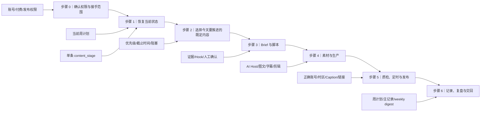

# 社媒内容生产接手指南

这份文档供**第一次接触 Pengman 工作区的人类和其 AI 助手**使用。适用场景包括临时请假、星期中途接手、协助生产，以及新成员第一次参与选题、制作或发布。

它是鱼骨式导航，不是第二套 SOP、日历或状态表：本页告诉你先后顺序、判断分支和完成标准；具体规则通过 Obsidian 链接进入现有权威文件。

## 先记住三句话

1. **星期中途接手时，不要从选题重新开始。**先执行当前周已经锁定的内容。
2. **当前周计划说明打算做什么；单条主记录的 `content_stage` 说明实际做到哪里。**两者冲突时，以主记录为准。
3. **不确定账号、付费、发布权限或事实时先停。**不要猜密码、补事实、调用付费工具或把草稿发出去。

## 总鱼骨



纯文字主骨：

```text
确认权限
→ 恢复状态
→ 选择既定任务
→ Brief 与脚本
→ 素材与生产
→ 质检、定时与发布
→ 记录、复盘与交回
```

## 第一次接手：前 20 分钟

### 0–5 分钟：确认你能做什么

确认以下四项；不清楚就写“待确认”：

- 临时接手人和接手时间；
- 可以使用哪些账号与工具；
- 是否可以产生 credits / 订阅费用；
- 是否可以定时或正式发布。

若 Pengman 无法确认，由业务负责人指定临时决策人，并在当前周计划记录：

```yaml
temporary_decision_owner:
handoff_started_at:
authorized_scope: 只读 / 制作 / 付费生成 / 定时 / 发布
handoff_reason:
```

没有明确授权时，默认只允许读取、整理状态和准备草稿，不允许付费生成或对外发布。

### 5–12 分钟：让 AI 读取最小资料

按顺序读取：

1. [[inbox-pengman/AGENTS|工作区权限与权威顺序]]
2. 本接手指南
3. [[inbox-pengman/04-production/README|内容生产工作区入口]]
4. [[inbox-pengman/04-production/00-evergreen-workflows/ai-advisor/当前状态与决策记录|当前状态与决策记录]]
5. [[inbox-pengman/04-production/03-weekly-content-plans/README|周度内容计划入口]]中的当前周计划
6. 当前周计划涉及的 `07-content-production/` 单条主记录
7. [[inbox-pengman/04-production/05-weekly-digests/README|最近发布合集]]和 `07-reports/` 最近周报
8. [[inbox-pengman/04-production/01-strategy-and-platform-research/AstrologyWiki 社媒账号定位与内容路由 Playbook|账号定位与内容路由 Playbook]]

`当前状态与决策记录` 只是滚动快照。若它与当前周计划或主记录冲突，以更具体、更新的主记录为准，并把冲突列出来；不要默默覆盖。

### 12–20 分钟：只输出接手卡，不开始制作

AI 先给接手人一张卡：

```markdown
## 接手读取回执
- 实际读取文件：
- 当前周和运行模式：
- 接手权限：

## 当前队列
| content_id | 账号 | content_stage | deadline / publish time | 下一人类动作 | 阻塞 |

## 今天建议顺序
1.
2.
3.

## 禁止自动推进
- 缺少授权：
- 缺少事实：
- 缺少脚本确认：
- 缺少发布证据：
```

接手人确认这张卡后，才进入下一步。

## 星期中途接手：怎么选择今天的任务

星期二至星期五默认**不生成新候选、不重排整周计划**。按以下顺序处理当前周已有内容：

1. 已到发布时间但仍未完成的 P0 / Predictable 内容；
2. 已经 `ready` 且有 `scheduled_at`、需要核验是否公开的内容；
3. 距离 deadline 最近、且没有阻塞的既定内容；
4. 已经投入付费 credits 或大量制作时间的半成品；
5. 低成本、可以为下周形成库存的内容。

以下情况才进入选题流程：周一建计划、负责人明确要求重排、确认需要补库存，或出现达到门槛的 Hot。详细规则见 [[inbox-pengman/04-production/00-evergreen-workflows/weekly-rolling-content-production-sop|Weekly Rolling SOP]]和 [[inbox-pengman/04-production/00-evergreen-workflows/astrologywiki-social-workflow/SKILL|候选研究与 Hot Skill]]。

## 看 `content_stage` 就知道下一步

| 当前阶段 | 接手人下一步 | 完成后 | 详细入口 |
|---|---|---|---|
| `selected` | 看 `script_status` 和下一动作；完成 Brief、调研、脚本确认和素材准备，实际开始制作时推进 | `producing` | 统一 Brief、AI 内容协作说明、对应制作 SOP |
| `producing` | 打开已有项目，确认缺口后继续；完成成片、字幕和基础质检，不从头重做 | `ready` | 对应主记录的制作区块 |
| `ready` | 有 `scheduled_at` 就等待并核验公开；无定时则排期或标记 `inventory_ready` | `published` 或保持 `ready` | 本页发布检查 |
| `published` | 核对真实链接、平台 ID、发布时间；填写 `decision / next_test` 完成复盘 | 保持 `published` | weekly digest / 周报 |
| `hold / cancelled` | 不自行恢复；查看原因、复查日期和负责人决定 | 等待决定 | 单条主记录 |

## 分步骤操作

### 1. 选题与建档

只有满足候选权限门时才执行。

1. 先看当前周产能、账号缺口和最近发布去重。
2. 完成实时来源核验和 Evidence Preflight。
3. 依 [[inbox-pengman/04-production/01-strategy-and-platform-research/AstrologyWiki 社媒账号定位与内容路由 Playbook|账号定位与内容路由 Playbook]]判断当前 active 账号，不把一个主题强塞给两个账号，也不自行恢复暂停账号。
4. 候选留在候选池，不写生命周期阶段；临时决策人或 Pengman 明确确认并纳入未来两周产能后，才进入 `selected`。
5. 在 [[inbox-pengman/04-production/07-content-production/README|07-content-production]]建立唯一主记录。

新手不要从历史每日选题池、旧聊天或旧 `04-content-production` 目录挑一条直接制作。

### 2. Brief、调研与脚本

1. 用 [[inbox-pengman/04-production/00-evergreen-workflows/统一内容 Brief 模板|统一 Brief 模板]]确认：写给谁、解决什么问题、在哪个账号发、使用什么形式、为什么现在做。
2. 需要外部关系机制、社区语言或竞品证据时，走以下链路：

```text
Perplexity / Gemini 调研
→ 总控军师审证、去重并冻结方向
→ Claude 写稿
→ 总控军师审稿
→ 临时决策人 / Pengman 确认
```

完整记录格式见 [[inbox-pengman/04-production/00-evergreen-workflows/Pengman 与 AI 内容润色协作说明#调研驱动的单稿流程|调研驱动单稿流程]]。

3. 未取得人类确认时保持 `selected` 和 `script_status: 待确认`。
4. 人类明确确认后写 `script_status: 已确认`、`confirmed_script_version`；仍保持 `selected`，实际开始生成、剪辑或组装时才进入 `producing`。

### 3. 素材与生产

先看主记录的 `format`：

- `AI Host / Short Video / Text Video / B-roll / Slideshow`：进入 [[inbox-pengman/04-production/00-evergreen-workflows/ai-short-video-production-workflow|AI Short Video Production Workflow]]。
- `Photo / Carousel`：进入 [[inbox-pengman/04-production/00-evergreen-workflows/instagram-image-content-workflow|Instagram Image Content Workflow]]。

新手生产原则：

- 先复用主记录中已确认的脚本、Host、声音、字幕和视觉，不临时换风格；
- 付费生成前记录工具、预计费用或 credits，并确认权限；
- 每次生成记录实际 credits、耗时、是否成功和返工原因；
- AI Host 出现错读、声音僵硬、多余特效或画面错误时，不因文件已经生成就自动进入 `ready`；
- `producing` 同时最多 3 条；接手期间优先完成已有半成品。

### 4. 质检、定时与发布

#### 发布前检查

- [ ] `content_id`、目标账号和平台正确；
- [ ] 使用的是已确认脚本和最终成片；
- [ ] 9:16、字幕、声音、封面和画面可读；
- [ ] Caption、hashtags、CTA 与主记录一致；
- [ ] 日期、人物、天象和安全提示已核验；
- [ ] 没有多余特效、错误画面、版权或授权风险；
- [ ] 发布时间按目标受众时区判断；美国观众为主时，不按“北京时间看起来是否太晚”直接判断；
- [ ] 已确认接手人拥有定时/发布权限。

#### 平台完成定时后

立即在主记录写：

```yaml
content_stage: ready
publish_date:
scheduled_at:
scheduled_timezone:
```

`scheduled_at` 使用带时区的 ISO 时间；不确定时区时不要猜。

#### 帖子公开后

1. 打开公开视频，复制真实链接；
2. 核对发布账号、Caption、画面和声音；
3. 在主记录补：

```yaml
content_stage: published
published_url:
platform_post_id:
published_at:
```

4. 加入对应 [[inbox-pengman/04-production/05-weekly-digests/README|weekly digest]]。

没有真实链接时，不把 `published` 表述为完整核验发布。TikTok 公共采集可能随后自动补链接和平台 ID，但不能用“自动化应该会跑”代替当前检查；自动化边界见 [[inbox-pengman/04-production/00-evergreen-workflows/tiktok-public-capture/README|TikTok Public Capture]]。

### 5. 记录、复盘与交回

接手结束时，不另建交接状态表。只更新：

1. 当前周计划：实际完成、阻塞、排期和临时决策人；
2. 每条主记录：真实 `content_stage`、确认稿、制作成本和发布证据；
3. weekly digest / 周报：真实发布、公开数据、`decision / next_test`。

给 Pengman 的交回摘要只需包含：

```markdown
- 接手时间：
- 完成了什么：
- 每条内容现在的 content_stage：
- 产生的 credits / 费用：
- 已定时或发布的真实链接：
- 未解决阻塞：
- 需要 Pengman 回来后确认的决定：
```

## 可直接交给接手人 AI 的启动指令

```text
你现在协助一位第一次接手 Pengman 社媒工作的同事。不要根据聊天印象或文件名猜进度，也不要创建第二套日历、状态表或生产队列。

请按顺序实际读取：
1. inbox-pengman/AGENTS.md
2. inbox-pengman/04-production/00-evergreen-workflows/社媒内容生产接手指南.md
3. inbox-pengman/04-production/README.md
4. inbox-pengman/04-production/00-evergreen-workflows/ai-advisor/当前状态与决策记录.md
5. 当前周的 04-production/03-weekly-content-plans/YYYY-Www 周度内容计划.md
6. 当前周计划涉及的 04-production/07-content-production 单条主记录
7. 最近的 04-production/05-weekly-digests 发布合集和 07-reports 周报
8. 04-production/01-strategy-and-platform-research/AstrologyWiki 社媒账号定位与内容路由 Playbook.md

先只输出：
- 实际读取回执；
- 当前周及运行模式；
- 当前内容队列及每条真实 content_stage；
- 星期中途接手时今天最应该推进的 1–3 项；
- 每项下一人类动作、预计时间和完成标准；
- 权限、付费、脚本确认、账号访问和发布证据方面的阻塞；
- 资料冲突及判断依据。

规则：
- content_stage 是唯一生命周期真相源；
- 周计划与主记录冲突时，以主记录判断实际阶段；
- 星期二至星期五不从零生成候选，不自行重排；
- 缺少真实链接时不完整确认 published；
- 未获明确授权时不调用付费工具、不定时、不发布；
- 输出接手卡并等待人类确认后，才进入具体制作指导。
```

## 这份指南不能替代的信息

即使文档完整，以下外部状态仍必须由接手人确认：

- TikTok、HeyGen、CapCut 等账号是否可登录；
- 当前 credits / 余额和付费权限；
- 平台后台尚未公开的定时队列；
- 本地成片和 CapCut 项目具体存放位置；
- Pengman 无法确认时，谁拥有最终脚本、付费和发布决定权。

缺少这些信息时，AI 应明确报告阻塞，而不是自行补全。
