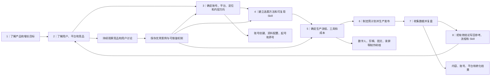

# 社媒运营总流程（鱼骨）

这是一张面向**任何产品和任何第一次参与社媒工作的人**的总地图。AstrologyWiki 是当前已经开始实践的案例，但主干可以复用到其他项目。

本页只回答三件事：

1. 一套完整的社媒运营应该按什么顺序建立；
2. 每一步要得到什么结果，什么情况下才进入下一步；
3. 想看具体操作时，应该打开哪一份树枝文档。

本页不保存本周排期、单条内容进度或发布数据，也不复制各树枝的详细规则。

## 一眼看懂整套流程



纯文字主干：

```text
了解产品和增长目标
→ 了解用户、平台和竞品
→ 确定账号数量、平台、定位、风格和内容方向
→ 建立选题方法和可复用 Skill
→ 确定生产流程、工具和成本
→ 制定周计划并生产发布
→ 收集数据并复盘
→ 把有效结论写回竞品参考、账号规则、生产流程和 Skill
→ 进入下一轮
```

其中，“持续观察竞品和用户讨论”不是只做一次。它在账号运行期间持续进行，并不断向账号策略、选题、制作形式和复盘提供新信息。

## 什么时候从哪一步开始

| 场景 | 从哪里开始 | 不需要做什么 |
|---|---|---|
| 第一次为一个新产品搭建社媒 | 从第 1 步开始，完整走到第 8 步 | 不要先开一堆账号或直接批量生产 |
| 产品和账号已经确定，开始新一周 | 从第 2 步的最新观察开始，再进入第 6 步 | 不要每周重新发明账号定位 |
| 星期中途继续当前工作 | 直接打开当前周计划和已有内容详情 | 不要重新从产品研究或选题开始 |
| 某个账号长期表现不佳 | 回到第 2、3、7 步重新检查证据 | 不要只凭一两条低播放立刻换定位 |
| 准备新增账号、平台或形式 | 回到第 1–3 步说明独立目标，再验证第 5 步产能 | 不要因为“别人也有这个号”就新增 |

星期中途接手当前内容的具体方法见 [[inbox-pengman/02-生产/00-evergreen-workflows/社媒内容生产接手指南|社媒内容生产接手指南]]。

## 1｜了解产品和增长目标

### 要回答的问题

- 产品解决什么问题，用户为什么会需要它；
- 目标用户是谁，主要市场和语言是什么；
- 目前最重要的业务目标是什么：曝光、关注、访问、注册、购买，还是验证需求；
- 社媒希望用户完成什么动作，哪些页面或功能可以承接；
- 哪些宣传说法不能使用，哪些事实必须核对。

### 最低完成结果

进入下一步前，至少要有一页人人看得懂的产品说明，包含：

- 一句话产品定位；
- 目标用户和目标市场；
- 当前最重要的增长目标；
- 希望社媒带来的具体用户动作；
- 可以使用的产品页面、功能和素材；
- 品牌语气、事实边界和禁止表达。

如果这些信息互相冲突，先向产品负责人确认，不用 AI 自行补全。

### 当前 AstrologyWiki 可参考资料

- [AstrologyWiki 网站](https://astrologywiki.com)
- [[inbox-pengman/01-调研资料/方法论/产品体验与反馈/AstrologyWiki 产品体验与问题记录/AstrologyWiki 产品体验|AstrologyWiki 产品体验与问题记录]]
- [[inbox-pengman/01-调研资料/历史调研/历史任务与职责/0615AstrologyWiki 内容运营与增长任务梳理|AstrologyWiki 内容运营与增长任务梳理]]（历史背景，不覆盖当前目标）
- [[inbox-pengman/02-生产/01-reference/README|当前生产参考入口]]

当前缺口：工作区里还没有一份集中维护、明确标为当前权威来源的“AstrologyWiki 产品定位与增长目标”文档。建立该文档后，应把它链接到生产参考入口，本页只保留链接。

## 2｜了解用户、平台和竞品

这一阶段不是只找“和产品一模一样的公司”。需要分开看：

1. **产品竞品**：与产品功能、目标用户或付费需求相似；
2. **内容竞品**：在同一领域争夺观众注意力，内容、账号形式或表达值得研究；
3. **用户讨论**：Reddit、TikTok 评论、搜索问题和社区帖子中，用户正在问什么、怎样表达；
4. **平台环境**：不同平台适合什么格式、发布节奏、互动方式和承接动作。

### 每次研究要记录什么

- 原始账号、帖子或网页链接；
- 查看日期和可见数据；
- 它服务的用户和账号类型；
- 开头、结构、画面、语言、引导方式和评论反应；
- 可以借鉴的机制；
- 不适合本产品或不能复制的部分。

不能只保存截图或一句“这个很爆”。也不能把竞品原句、人物素材或视觉直接复制进自己的内容。

### 当前树枝

- [[inbox-pengman/01-调研资料/README|调研资料入口]]
- [[inbox-pengman/01-调研资料/平台与策略/README|平台与内容策略研究]]
- [[inbox-pengman/01-调研资料/候选与热点研究/README|候选与热点研究说明]]
- [[inbox-pengman/06-requirements/社媒竞品账号与视频链接分析工具需求文档|竞品账号与视频链接分析工具需求]]
- [当前固定参考账号索引 CSV](https://script.google.com/macros/s/AKfycbyunRIRkIyxEFRUIPstyKFPebAE2rBZB8CBFmoTWzJkhBl-ugAsakxHwZipbT4hTOgANg/exec)

完整调研放在 `01-调研资料/`。只有已经反复需要、会直接影响生产判断的精简规则或优秀案例索引，才进入 `02-生产/01-reference/`，不要把同一份研究复制两遍。

当前缺口：`02-生产/01-reference/` 还没有一份当前维护的“竞品优秀案例与适用账号索引”；自动寻找新竞品也仍在计划阶段，不能写成已经稳定运行。

## 3｜确定账号、平台、定位和风格

竞品调研完成后，再决定要不要开账号、开几个、在哪些平台，以及每个账号承担什么任务。

### 每个账号都要说清楚

- 它服务哪个业务目标；
- 面向谁；
- 为什么现有账号不能承担这项任务；
- 主要内容栏目和形式；
- 账号语气、人物形象和视觉风格；
- 每周实际能生产多少；
- 第一批测试多少条；
- 用什么数据决定继续、调整或停止。

账号数量是调研和产能共同得出的结果，不是越多越好。没有独立用户任务、产能或停止条件的账号，不进入正式运营。

### 当前树枝

- [[inbox-pengman/02-生产/01-reference/AstrologyWiki 社媒账号分工与内容发布指南|AstrologyWiki 账号分工与内容发布指南]]
- [[inbox-pengman/02-生产/00-evergreen-workflows/通用社媒账号起号与轻量养号流程|通用社媒账号起号与轻量养号流程]]
- [[inbox-pengman/05-account-assets/README|账号和品牌资产入口]]

当前 AstrologyWiki 只启用 `@astrologywiki` 与 `@miraaastrology`。历史四账号方案和暂停账号不自动恢复。

## 4｜建立选题方法和可复用 Skill

选题 Skill 不是凭空生成题目的机器。它应该把前面得到的产品目标、目标观众、账号定位、竞品机制、真实用户讨论和历史数据组合起来，帮助人类生成数量有限、能实际生产的候选。

### 正确的形成顺序

```text
产品和账号信息
→ 当前竞品与用户讨论
→ 历史已发布内容和真实数据
→ 生成少量候选
→ 人工选择
→ 生产和发布
→ 数据复盘
→ 稳定结论再更新 Skill
```

不要把每一条竞品内容直接“喂进 Skill”。更合适的分层是：

- 原始案例和完整拆解放在 `01-调研资料/`；
- 经常需要调用的优秀案例索引和稳定机制放在 `02-生产/01-reference/`；
- 同一种人工修改或内容结论跨 2–3 条得到重复验证后，才提议写入 Skill；
- Skill 更新仍需 Pengman 确认，不能让一次高播放永久改变账号方向。

### 当前树枝

- [[inbox-pengman/skills/README|社媒 Skills 使用入口]]
- [[inbox-pengman/skills/gengrowth-social/SKILL|通用社媒内容策略 Skill]]
- [[inbox-pengman/skills/gengrowth-tiktok-strategist/SKILL|TikTok 内容适配 Skill]]
- [[inbox-pengman/skills/gengrowth-social-media-analyzer/SKILL|社媒数据分析 Skill]]
- [[inbox-pengman/skills/astrologywiki-social-workflow/SKILL|AstrologyWiki 候选研究与执行 Skill]]

通用 Skill 不写死 AstrologyWiki。使用时由当前产品说明、账号分工、产能和数据提供实际背景。

## 5｜确定生产流程、工具和成本

这一阶段把“想做什么”变成“团队确实做得出来”。按内容形式分别确定：

- 从脚本确认到成片、检查、定时和发布的步骤；
- 人负责什么，AI 分别负责调研、判断、写稿还是制作；
- 使用哪些工具，免费或付费；
- 单条内容大约耗时、额度和返工次数；
- 哪些步骤必须人工确认；
- 成片达到什么标准才可以发布。

工具有说明文档或做过一次试验，不代表已经成为稳定流程。只有多次实际完成、成本和质量可接受，才写成当前生产方法。

### 当前树枝

- [[inbox-pengman/02-生产/00-evergreen-workflows/README|可复用流程索引]]
- [[inbox-pengman/02-生产/00-evergreen-workflows/Pengman 与 AI 内容润色协作说明|Pengman 与 AI 内容协作说明]]
- [[inbox-pengman/02-生产/00-evergreen-workflows/统一内容 Brief 模板|统一内容要求模板]]
- [[inbox-pengman/02-生产/00-evergreen-workflows/ai-short-video-production-workflow|AI 短视频制作流程]]
- [[inbox-pengman/01-调研资料/工具调研/README|工具调研入口]]

还没有跑通的形式继续保留为试验或待验证，不要为了让鱼骨看起来完整而写成已经可以交接的 SOP。

## 6｜制定周计划并生产发布

进入稳定运营后，日常工作从这里开始，而不是每天回到第 1 步。

### 当前周节奏

```text
周一：根据目标、数据、库存、产能和最新调研确定本周组合
→ 周二至周四：集中调研、写稿、制作和确认
→ 周五：检查、定时、库存和复盘
→ 下周发布上周库存，同时生产下一周内容
```

临时恢复周、热点插入或同周生产发布，只写在对应周计划里，不自动变成长期规则。

### 当前树枝

- [[inbox-pengman/02-生产/README|内容生产工作区入口]]
- [[inbox-pengman/02-生产/00-evergreen-workflows/weekly-rolling-content-production-sop|每周内容生产流程]]
- [[inbox-pengman/02-生产/04-weekly-content-plans/README|周度内容计划入口]]
- [[inbox-pengman/02-生产/02-content-production/README|每条内容详情入口]]
- [[inbox-pengman/02-生产/00-evergreen-workflows/社媒内容生产接手指南|第一次接手或临时替班指南]]

本周计划说明本周组合；每条内容详情页说明实际做到了哪里。两者冲突时，以内容详情页里的实际进度为准，不另建第二套进度表。

## 7｜收集数据并复盘

复盘不能只回答“播放高不高”。需要回到这一轮最初要验证的问题。

### 至少检查四层结果

1. **内容表现**：播放、停留、完播、点赞、评论、分享和收藏；
2. **账号增长**：关注、主页访问、受众结构和系列连续性；
3. **业务承接**：链接点击、合格访问、工具使用、注册或购买；
4. **生产效率**：耗时、费用、返工、工具稳定性和人工确认点。

小样本只能形成暂时判断。复盘要区分已经核验的数据、根据数据作出的运营推断，以及还需要补充的信息。

### 当前树枝

- [[inbox-pengman/02-生产/03-data-review/README|数据复盘入口]]
- [[inbox-pengman/skills/gengrowth-social-media-analyzer/SKILL|社媒数据分析 Skill]]
- [[inbox-pengman/tools/tiktok-public-capture/README|TikTok 公开数据采集说明]]

没有真实帖子链接、平台 ID 或实际发布时间时，不把发布结果写成已经完整核验。

## 8｜把结果写回系统，进入下一轮

复盘的价值不是多一份报告，而是让下一轮更准确。

| 得到的结论 | 写回哪里 |
|---|---|
| 某条内容的实际结果和下一次测试 | 该内容详情页和本周数据复盘 |
| 下周继续、减少或调整什么 | 下一份周计划 |
| 某个账号长期应该做什么或避免什么 | 账号分工与内容发布指南 |
| 某种形式已经稳定跑通 | 对应生产流程 |
| 某种竞品机制值得反复参考 | 生产参考目录中的优秀案例索引 |
| 跨多条内容稳定成立的选题或表达规则 | 对应 Skill，经过 Pengman 确认后更新 |
| 用户反馈暴露产品问题或新需求 | 产品体验与反馈记录或正式产品需求入口 |

不要追溯修改历史报告来制造一致性。保留当时事实，在当前权威文档里更新新结论即可。

## 当前运行成熟度｜AstrologyWiki 实践

> 最近核验：2026-08-07。这里记录的是整套流程的成熟度，不保存本周内容进度。每条内容当前做到哪里，仍以对应内容详情页为准。

判断口径：

| 标记 | 含义 |
|---|---|
| **已运行** | 有多次真实执行、发布结果或近期自动化输出，可以确认这部分实际能工作 |
| **做过，待验证** | 有样本或试验，但数量、数据或执行完整度不足，不能称为稳定流程 |
| **尚未运行** | 只有文档、计划、需求或想法，没有实际执行证据 |
| **文档风险** | 流程可能做过，但入口或路径仍有问题，会妨碍新人或 AI 正确接手 |

### 已运行：目前证据最充分的部分

| 环节 | 已经实际做到什么 | 当前可以怎样表述 |
|---|---|---|
| 单条内容调研 | 已经使用 Perplexity、Gemini、Reddit、公开竞品和用户讨论为具体选题补充资料 | 已经能为一条确定内容提供研究输入；不代表持续竞品监控已经自动运行 |
| AI 协作写稿 | 已实际采用“调研模型找资料 → 总控军师核对并确定方向 → Claude 写稿 → 总控军师审稿 → Pengman 确认” | 单条内容的多模型协作已经跑通 |
| Miraa 数字人制作 | W32 连续完成 6 条 AI Host 成片，并多次实际发布或定时 | 固定主播、字幕、背景和 HeyGen 网页端生产路径已经能连续使用 |
| HeyGen 常规成本 | 常规路径约 `20 credits / 条`；30-credit Video Chat Agent 试验单独记录为例外 | 可以使用 20 credits 作为当前常规估算，但不能把所有 HeyGen 模式都写成这一成本 |
| 内容详情和发布证据 | 已有未发布、已发布内容详情，能够保存确认稿、实际进度、定时信息和真实链接 | 单条内容详情页可以作为实际进度的唯一来源 |
| TikTok 公开数据采集 | 已有连续输出文件、公开指标采集和真实发布链接自动回写记录 | TikTok 自家账号的公开数据采集有近期运行证据 |
| 周报和公开数据复盘 | 已经生成多周周报，并能区分真实数据、运营推断和待补信息 | 公开数据层面的周报与内容复盘已经可以执行 |

当前最完整的小闭环是：

```text
为一条内容调研
→ 总控军师确定方向
→ Claude 写稿
→ Pengman 确认
→ HeyGen 制作
→ 人工检查、定时或发布
→ TikTok 公开数据采集和链接回写
→ 周报复盘
```

这能证明“单条数字人内容可以完成并留下公开结果”，还不能证明整棵鱼骨已经全部跑通。

### 做过，但仍需补样本或补数据

| 环节 | 已有执行 | 为什么还不能称为跑通 | 下一步怎样验证 |
|---|---|---|---|
| 当前两账号定位 | 已形成官号与 Miraa 的分工，并有真实内容样本 | 这套定位是伴随 AstrologyWiki 实践逐步整理的，没有完整记录“产品与竞品研究如何推导出账号数量、平台和风格” | 用当前数据继续验证账号角色；未来新产品再完整走一次第 1–3 步 |
| AstrologyWiki 选题 Skill | 已用于候选研究、来源检查和账号判断 | 还没有稳定完成“竞品案例 → Reference → 内容测试 → 数据验证 → 更新 Skill”的循环 | 为每次 Skill 更新保存来自多条内容的重复证据，并由 Pengman 确认 |
| 标准滚动周 | 已建立周计划、生产队列和库存规则 | W31 因请假只工作一天；W32 是同周生产发布的恢复周例外，尚未正常完成“本周发库存、本周做下周”的完整一周 | 在正常周建立并消耗一次真实库存，再检查周一到周五是否能按规则运行 |
| 数字人完整 Batch 效率 | W32 已连续完成 6 条成片 | 完整 Batch 的总耗时、失败次数、返工次数和人工确认点还没有全部记录 | 下一批统一记录开始时间、生成次数、credits、返工原因、人工确认点和总耗时 |
| 官号图文和 Short Text Video | 已有真实制作和发布样本 | 样本少，缺图文完成率、制作时间、主页访问和链接点击，无法判断是否值得扩大 | 每种形式各补一个控制变量清楚的 canary，并同时记录内容表现与制作成本 |
| CTA | 已在部分内容中使用并观察结果 | W31 分组受到题材、脚本和 Caption 差异污染，结果为 `inconclusive` | 使用同规格内容建立干净的有 CTA / 无 CTA 小样本对照 |
| 内容数据复盘 | 已能读取播放和公开互动，并在部分内容取得后台观看或增粉数据 | 统一的 24h/72h 留存、主页访问、单帖增粉和点击尚未稳定补齐 | 固定观察窗口和后台字段，不用不同时间点的累计数据直接比较 |
| 复盘回到下周选题 | 已经在周报中写 `decision / next_test` 并影响后续选题 | 结论还没有稳定进入竞品参考、账号规则和 Skill，回流主要依赖人工记忆 | 每周复盘时明确判断结论只留单条、进入 Reference，还是达到更新 Skill 的门槛 |

### 尚未运行：目前只有文档、计划或待验证想法

| 环节 | 当前事实 | 完成标志 |
|---|---|---|
| 当前权威的产品定位与增长目标 | 有产品网站、产品体验和历史职责资料，但没有一份当前统一维护的产品说明 | 建立一份当前产品说明，明确目标用户、市场、增长目标、承接页面、品牌边界和禁止表达，并接入生产参考入口 |
| 系统化的产品竞品地图 | 目前主要研究占星内容账号和高表现帖子；没有当前维护的 AstrologyWiki 产品竞品地图 | 区分产品竞品和内容竞品，形成带原始链接、用户、功能、商业模式和可借鉴点的当前研究 |
| 竞品优秀案例与适用账号索引 | `02-生产/01-reference/` 尚无当前维护的优秀案例索引 | 每个案例注明适合参考的账号、内容形式、可借鉴机制和不可复制部分 |
| 自动寻找新竞品 | Social 机器人可以分析人工提供的账号、视频和 Photo 链接，但不能自动寻找新竞品 | 出现近期成功运行记录，能定期发现候选、去重、保存来源并交给人工确认 |
| 定期竞品学习回流 | 现在主要按具体内容临时调研，没有稳定的定期采集、筛选和回流节奏 | 至少连续数周完成“采集 → 拆解 → Reference → 选题/制作使用 → 复盘” |
| 官号录屏＋剪辑 | 有研究和 canary 计划，尚无实际执行证据 | 完成并发布至少一条，记录脚本、录屏路径、剪辑、检查、耗时、结果和下一次修改 |
| 视频混剪 | 有工具研究，没有实际发布样本 | 完成一次从素材授权到发布复盘的完整 canary |
| X 账号起号养号 | 因病假顺延，尚无本轮发布和数据证据 | 按起号流程完成账号检查、首批内容发布和观察记录 |
| 新账号启用方法 | MBTI、独立录屏和历史热点账号均暂缓，没有按新启用条件完成一个有限测试 Batch | 一个新账号从独立目标、资源预算、首批内容到继续/停止判断完整走完一次 |
| 社媒到产品的转化闭环 | 主页访问、链接点击、qualified UV、工具使用、注册和购买没有形成有效验证 | 使用真实可点击链接和可追踪参数，取得从内容到产品动作的完整数据 |
| 社媒反馈进入产品决策 | 目前能记录用户问题和产品体验，但没有稳定交给产品侧并跟踪结果的闭环 | 至少一个社媒发现的问题进入产品需求、得到处理决定并回写结果 |
| 第一次接手者独立完成工作 | 接手指南和鱼骨已写成，但没有让从未参与的人及其 AI 只靠文档完成一条内容 | 找一位新接手者从读文档开始完成一条内容，记录看不懂、找不到和必须口头询问的地方 |
| 跨产品复用 | 当前只有 AstrologyWiki 案例 | 用另一个产品替换产品、账号、竞品、工具和数据背景，完整走一次主干而不复制新目录系统 |

### 文档和入口风险

以下问题不等于流程完全没有运行，但会使新人或 AI 无法可靠复现：

- `skills/astrologywiki-social-workflow/SKILL.md` 中仍有旧 `04-production`、`02-daily-content-recommendations` 和 `05-weekly-digests` 路径；
- `skills/README.md` 的 AstrologyWiki 使用说明仍指向旧 `04-production` 路径；
- `weekly-rolling-content-production-sop.md` 的部分周计划、模板和内容队列链接仍指向旧路径；
- `tools/tiktok-public-capture/README.md` 对生产记录扫描目录的文字仍写旧 `04-production` 路径。

这些旧路径应统一修正后，再进行一次“从根目录总鱼骨开始，由陌生 AI 找到当前周任务”的接手测试。

### 当前总体结论

> **已经跑通的是单条数字人内容生产与公开数据记录的小闭环；尚未跑通的是“当前产品说明 → 持续竞品学习 → 账号与选题方法 → 多形式生产 → 业务转化 → 更新 Reference 和 Skill”的完整大闭环。**

这些缺口不妨碍继续执行当前周内容，但在声称“整套流程已经完全跑通”之前，需要逐项获得真实执行证据。

## 这张总鱼骨的维护规则

1. 主干步骤发生变化时才修改本页；具体操作变化只改对应树枝文档。
2. 新建树枝前先检查是否已有同类 SOP、参考文件、Skill 或工具说明。
3. 一个事实只在一个权威位置维护，本页只链接，不复制实时状态。
4. 过时流程移入历史目录，并明确“不作为当前执行入口”。
5. 新产品复用时保留主干，替换产品说明、账号策略、参考案例、工具和数据入口，不复制一整套目录。
